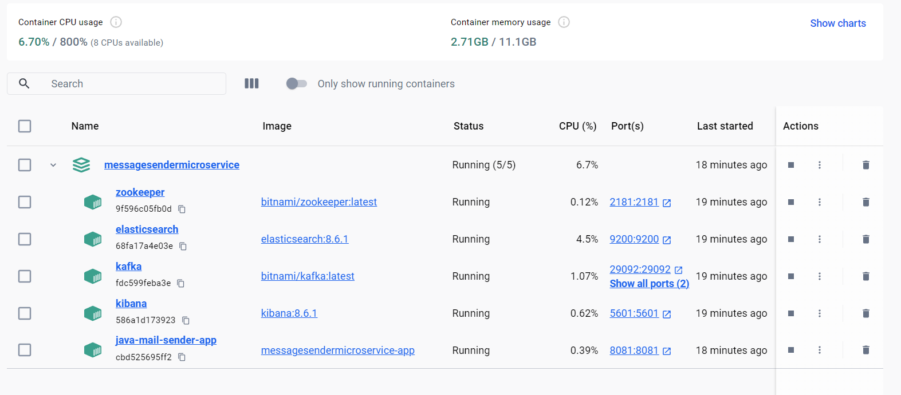
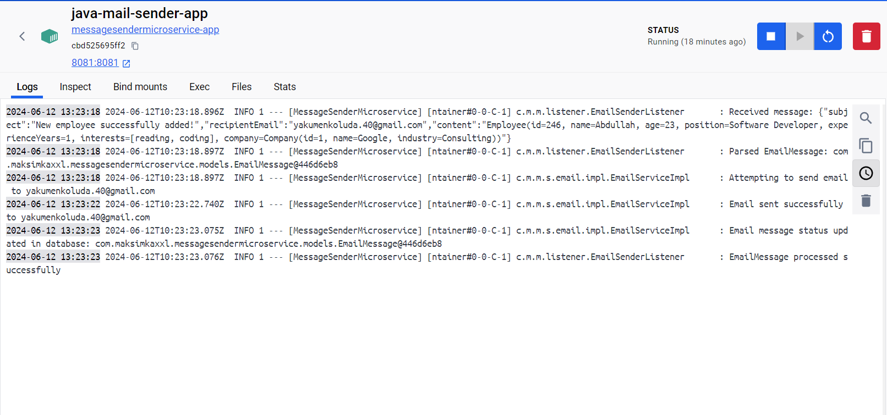

# Message Sender Microservice

The Message Sender Microservice is a component of the larger system designed to facilitate communication by sending email notifications. It serves as a microservice for the main service [Company Employee Service](https://github.com/MaksymChalyi/company-employee-service). This microservice sends messages via Kafka, and another microservice handles the actual email delivery.

### Dependencies

The Message Sender Microservice has the following dependencies:

- Docker Compose: For containerization and orchestration of the services.
- JavaMailSender: A component of Spring Framework used for sending email messages.
- Apache Maven: For building and managing the project dependencies.
- Kafka: Message Broker for communication between microservices.
- Elasticsearch: Used as the database for storing email messages and their statuses.
- Kibana: For visualizing and monitoring Elasticsearch data.

These dependencies are managed and configured within the project's `pom.xml` file and Docker Compose configuration.

## How to Run

1. Clone this repository and open in IDEA;

2. Create a `.env` file in the root directory of the project and specify your email host, port, username, and password:

```dotenv
EMAIL_HOST=smtp.gmail.com
EMAIL_PORT=587
EMAIL_USERNAME=your_email@example.com
EMAIL_PASSWORD=your_password
```

3. Generate a custom app password for your email following the instructions [here](https://youtu.be/ugIUObNHZdo?si=-H0asQgRuPEX5v0p&t=175).

4. Run the following command to clean and package the microservice:
```
   mvn clean package
```
5. Build and start the services using Docker Compose:
```
docker-compose up --build
```
**Note:** If you prefer to run the services locally, you can run Zookeeper, Elasticsearch, Kafka, and Kibana in Docker, while running the application locally.


### Screenshots:

- Microservices Running:
  

- Email Notification Sent:
  
  
  

**Developed by Maksym Chalyi in 2024.**


