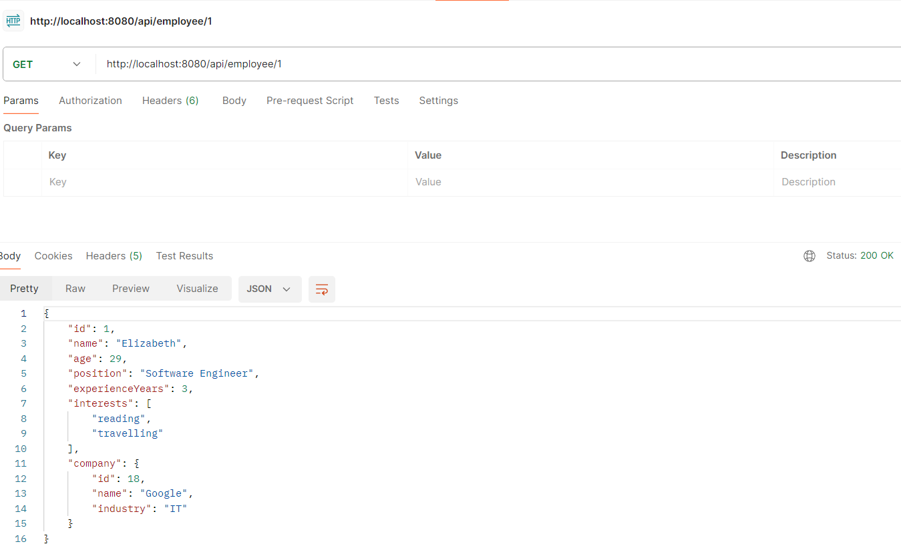
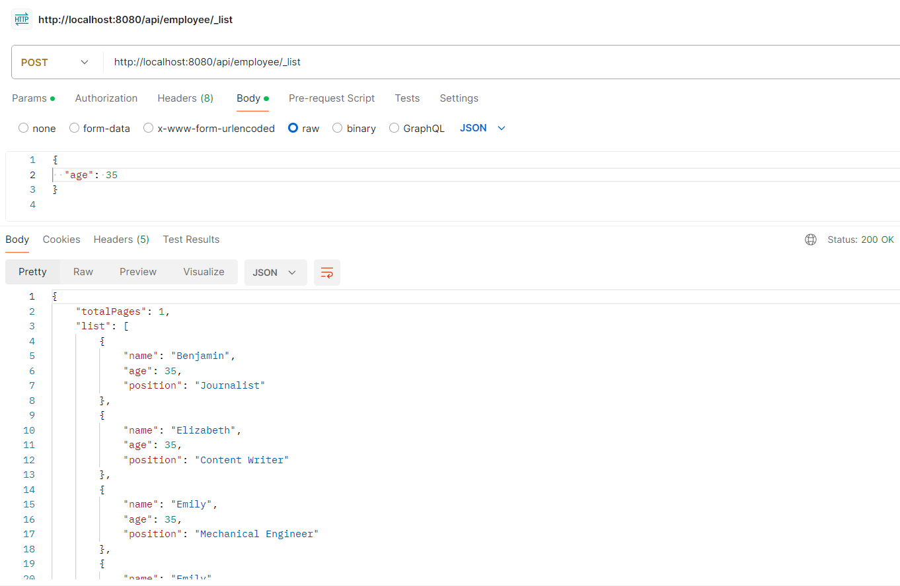

# Spring Boot RESTful API

This project implements a RESTful API using Spring Boot, allowing for the management of companies and employees. It provides endpoints for creating, updating, deleting, and retrieving companies and employees, as well as uploading employee data from a file and generating reports.

## Usage

1. **Clone the Repository**: Clone this repository to your local machine.
2. **Set Up the Database**: Configure the database settings in `application.properties`.
3. **Build and Run**: Build and run the application using Maven or your preferred IDE.
4. **Access the API**: Use tools like Postman to interact with the API endpoints.
5. **Before running the application, make sure Kafka and Zookeeper are started:**
## Features

- **Company Management**: Create, update, delete, and retrieve companies.
- **Employee Management**: Create, update, delete, and retrieve employees.
- **File Upload**: Upload employee data from a file JSON.
- **Report Generation**: Generate reports in CSV format based on specified criteria.
- **Connect with Email Sender microservice**: To create a new employee, send a POST request to /api/employees with the employee details in the request body. The application will save the employee details to the database and send a message to the Kafka topic mailSender. The Kafka consumer service will process the messages and send emails accordingly.

## Technologies Used

- **Spring Boot**: Framework for building Java applications.
- **Spring Data JPA**: Simplifies the implementation of data access layers.
- **Spring Web**: Provides basic web support, including RESTful APIs.
- **Jackson**: JSON (de)serialization library for Java.
- **Lombok**: Library for reducing boilerplate code in Java classes.


## Configuration
- **Kafka Topics**
  mailSender: Topic for sending employee details to be processed for sending emails.
- **Kafka Producer**
  A Kafka producer is integrated into the application to send messages to the mailSender Kafka topic whenever a new employee is created.

## API Endpoints
### Company Endpoints

- **Retrieve All Companies**: `GET /api/company`

  

- **Create a Company**: `POST /api/company`

  

- **Update a Company**: `PUT /api/company/{id}`

  

- **Delete a Company**: `DELETE /api/company/{id}`

  

### Employee Endpoints

- **Create an Employee**: `POST /api/employee`

  

- **Retrieve a Specific Employee**: `GET /api/employee/{id}`

  

- **Update an Employee**: `PUT /api/employee/{id}`

  

- **Delete an Employee**: `DELETE /api/employee/{id}`

  

- **Upload Employee Data from a File**: `POST /api/employee/upload`

  

- **Generate Employee Report**: `POST /api/employee/_list`

  

- **Generate Employee Report at CSV file**: `POST /api/employee/_report`

  


### Integration Tests

Integration tests cover the interaction between different components of the application to ensure they function correctly together. These tests are located in the following files:

- **EmployeeControllerTest.java**: Integration tests for employee-related endpoints.
- **CompanyControllerTest.java**: Integration tests for company-related endpoints.

These integration tests ensure that the API endpoints behave as expected and cover the underlying logic of the application.

## Data Import

To facilitate data import, a JSON file named `employees.json` is provided within the repository. This file is located at the following path:

```
src/main/resources/employees.json
```

You can use this file to import employee data into the application.


---

### License
This project is licensed under the MIT License. See the [LICENSE](LICENSE.md) file for details.

----

**Developed by Maksym Chalyi in 2024.**